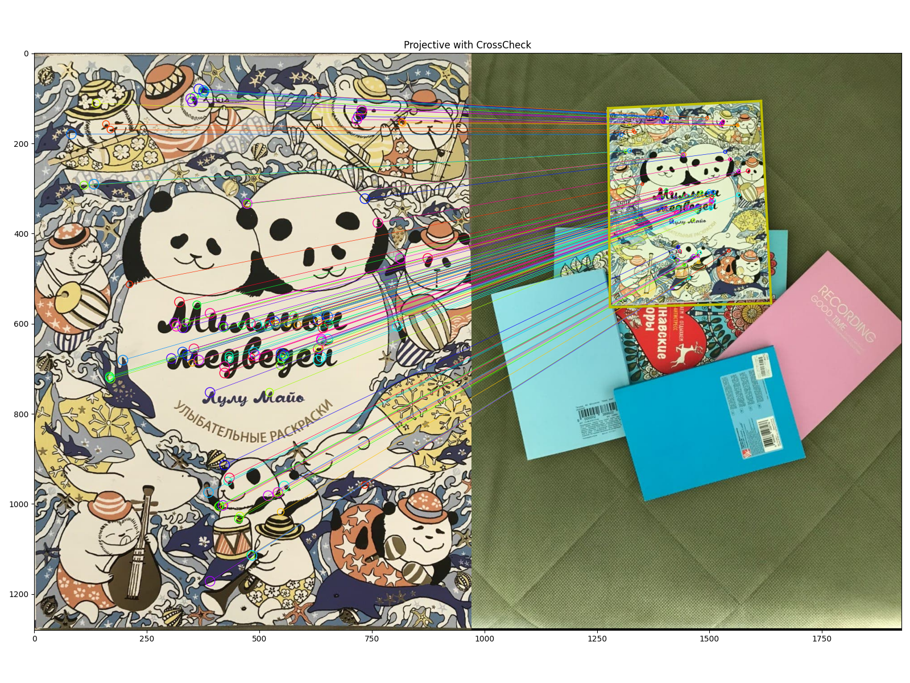
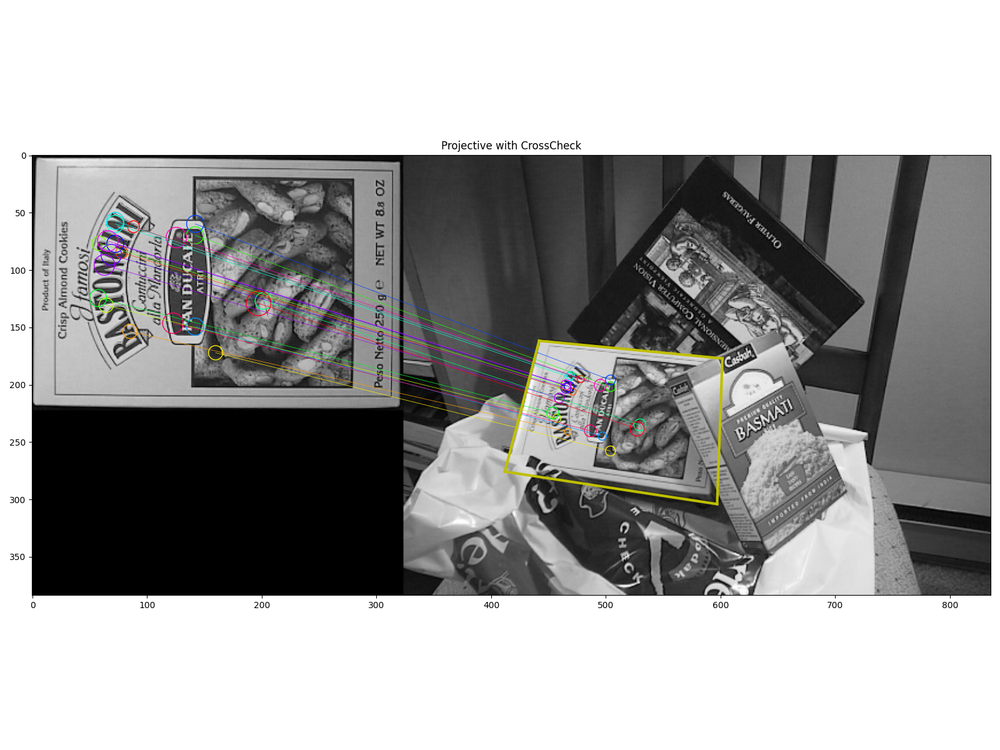

In this project we I implemented papers:
+ ORB: an efficient alternative to SIFT or SURF for detect keypoints
+ Distinctive Image Featuresfrom Scale-Invariant Keypoints for matching and object localization

